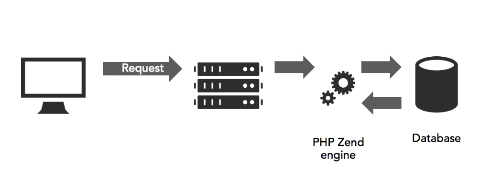

## 2. PHP Basics

1. PHP: The big picture
2. Choosing and naming variables
3. Displaying text and numbers
4. Comments and white space
5. What's the difference between single and double quotes?
6. Joining strings
7. Using heredoc syntax to avoid problems with quotes
8. Storing multiple values in an indexed array
9. Storing multiple values in an associative array
10. Challenge: Embedding PHP in HTML
11. Solution: Embedding PHP in HTML

### 2.1 PHP: The big picture

###### What PHP can do

- Process and email contact forms
- Upload files from online forms
- Generate thumbnails from larger images
- Watermark images
- Read and write files
- Date and time calculations
- Change content depending on date or time
- Communicate with a database

###### Workflow

1. [User] Visit website
2. [Web Browser] Sends a request to the web server
3. [Web Server] Sends the request to the PHP Zend engine
4. [PHP Zend engine] Sends the request to the Database
5. [PHP Zend engine] Sends the response to the Web Server
6. [Web Server] Sends the response to the Web Browser
7. [Browser] Presents the response to the User

PHP was designed as an embedded language

###### How PHP Works

- Common features in most PHP scripts
  - __Variables__: act as placeholders
  - __Arrays__: hold multiple variables
  - __Conditional statements__: to make decisions
  - __Loops__: Perform repetitive tasks
  - __Functions or objects__:  Perform preset tasks

###### Using PHP

- Use the filename extensions .php
- Use .php even if the pages contain only HTML. PHP can be added later without having to change the URL
- Store pages inside the server root folder

###### PHP Tags

    // Opening tag (don't use <? as the opening tag)
    <?php

    // Closing tag (optional when no other code follows)
    ?>

### 2.2. Choosing and naming variables

- Placeholder for an unknown or changing value
- The name of the variable remains the same, but it can represent different variables

###### Naming variables

- Begin with a $
- Letters, numbers, and the underscore are permitted
- First character after $ can't be a number
- No spaces or hyphens
- Names are case sensitive

###### Good Naming Practice

- Choose meaningful names
- Don't use single letters, except for counters
- Don't use cryptic abbreviations
- Use camel case or underscore for multiple words
  - $firstName
  - $first_Name

###### Reserved Names

- $this
- Superglobals - Superglobals are built-in variables that are always available in all scopes
  - $GLOBALS - References all variables available in global scope
  - $\_SERVER - Server and execution environment information
  - $\_GET - HTTP GET variables
  - $\_POST - HTTP POST variables
  - $\_FILES - HTTP File Upload variables
  - $\_COOKIE - HTTP Cookies
  - $\_SESSION - Session variables
  - $\_REQUEST - HTTP Request variables
  - $\_ENV - Environment variables
- $php_errormsg — The previous error message
- $HTTP_RAW_POST_DATA — Raw POST data
- $http_response_header — HTTP response headers
- $argc — The number of arguments passed to script
- $argv - Array of arguments passed to script

### 2.3 Displaying text and numbers

- echo
- print

    // Displays multiple values separated by commas
    echo $myVariable, ' ', $myOtherVariable;

    // Displays a single value
    print $myVariable

### 2.4 Comments and white space

- Single line
- Multiple line

    // Single line comment
    # Single line comment

    /*
      Multiple line comments
    \*/

###### White Space

PHP ignores white space

### 2.5 What's the difference between single and double quotes?

- Single quotes
  - Most coding standards recommend their use
  - All text is treated as literals
  - Does not escape variables
  - Only supported escape character is: \'
- Double quotes
  - Escape variables
  - Escape characters like New line, Carriage return, etc.

### 2.6 Joining Strings

    // example one
    $someVariable = $thisVariable . $thatVariable;

    // example two
    $variable = "$someVariable $withAnother";

    // example three
    $myVariable = "Text";
    $myVariable .= "With more text";

### 2.7 Using heredoc syntax to avoid problems with quotes

- Helps in creating easy to maintain strings that have a lot of quotes, such as SQL queries.
- Also allow us to use double, single quotes and escape variables.
- No spaces are allowed around the opening and closing identifier

    $heredoc = <<< EOT
    In "$title" by $author, $android the "paranoid android"
    complains that he's asked to do menail tasks, even
    though he's go "a brain $brain_size."
    EOT;

### 2.8 Storing multiple values in an indexed array

There's two types of arrays
- Indexed
- Associative

Arrays cannot be printed with echo. Instead we use print_r

    print_r($array);

Starting from PHP 5.4 we can create Arrays from literals

    $array = ['value1', 'value2'];

Add elements to an indexed/associative array

    $array[] = 'new value';

###### Indexed Array

    $array = ['value1', 'value2'];

Add elements to an indexed array

    // we use index numbers to reference elements
    $array[1] = 'new value'
    echo $array[1];

###### Associative array

    $array = [
      'key' => 'value',
      'otherKey' => 'its value'
    ]

Add elements to an associative array

    $array['key'] = 'value';
    echo $array['key'];

Expand an associative array

    echo "This is {$array['key']}";
